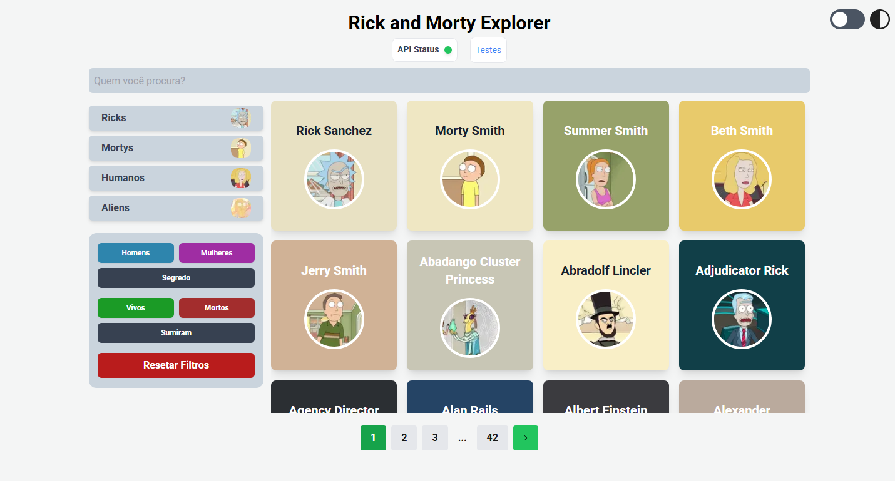

# Rick and Morty Explorer 🚀

Este projeto é uma web api client para a [Rick and Morty API](https://github.com/afuh/rick-and-morty-api) chamada **Rick and Morty Explorer**, que permite aos usuários buscar personagens, filtrar por atributos e navegar entre os resultados paginados. O projeto utiliza **Next.js**, **Node.js**, **MongoDB** e **Playwright** para testes.



---

## ✨ Features

🔍 Pesquisa Avançada: Encontre personagens rapidamente digitando seus nomes.

🎚 Filtros Poderosos: Refine sua busca por espécie, gênero e status.

🌙 Modo Escuro: Desfrute da experiência completa com um tema otimizado para ambientes escuros.

📜 Paginação Dinâmica: Navegue facilmente entre os resultados.

---

## 📂 Estrutura do Projeto
```
projeto/
│
├── docker-compose.yml       # Configuração do Docker Compose
├── Dockerfile.testing       # Dockerfile para Playwright
├── app/                     # Código-fonte da aplicação
├── tests/                   # Testes Playwright
├── Makefile                 # Comandos úteis para gerenciar os serviços
```

---

## 🚀 Como Rodar o Projeto

### **Pré-requisitos**
Certifique-se de ter o **Docker** e **Docker Compose** instalados:
```bash
# Verificar se o Docker está instalado
docker -v
# Verificar se o Docker Compose está instalado
docker-compose -v
```

### **Subindo a Aplicação**
Para iniciar todos os serviços:
```bash
docker-compose up -d
```
Isso iniciará os seguintes serviços:
- **app**: Servidor Node.js rodando o Rick and Morty Explorer.
- **playwright**: Container para execução dos testes Playwright.

Acesse a aplicação em:
```
http://localhost:3000
```

---

## 🐳 Configuração Docker

### **`docker-compose.yml`**
```yaml
services:
  app:
    image: node:18-alpine
    working_dir: /app
    volumes:
      - ./:/app
    ports:
      - "3000:3000"
    command: sh -c "yarn start"
    environment:
      - API_URL=https://rickandmortyapi.com/api/character

  playwright:
    build:
      context: .
      dockerfile: Dockerfile.testing
    working_dir: /app
    volumes:
      - ./:/app
    environment:
      - PLAYWRIGHT_APP_URL=http://host.docker.internal:3000
    command: sh -c "yarn test"
    depends_on:
      - app
```

- **`app`**: Roda o servidor Next.js.
- **`playwright`**: Executa os testes Playwright.
- **`API_URL`**: Define a API do Rick and Morty como fonte de dados.
- **Rede `rickandmorty`**: Define uma rede externa para comunicação entre containers.

---

## 🧪 Executando Testes com Playwright
Para rodar os testes Playwright:
```bash
docker-compose run --rm playwright
```
Para depuração:
```bash
docker exec -it playwright bash
```

## 🛠 Uso do Makefile
Para facilitar o gerenciamento, utilize o **Makefile**:

### **Comandos úteis**
```bash
make build        # Construir as imagens Docker
make front-build  # Build da aplicação frontend
make lint         # Rodar o linter
make dev         # Rodar a aplicação em modo de desenvolvimento
make up           # Subir os containers
make sh           # Acessar o container do app
make pw-sh        # Acessar o container do Playwright
make pw-build     # Construir o container Playwright
make down         # Parar e remover os containers
make test         # Rodar testes Playwright
make logs         # Ver logs dos containers
```


## Curiosidades

No auge da minha sabedoria, ao executar múltiplos testes e2e, acabei caindo no rate limit
da API. Precisei, as pressas, adaptar ao ambiente local o repositório opensource.

Também tive problemas de consistencia de testing no playwright, desde conexão de rede a testes que ora passam ora não passam, mesmo sem mudança de código. E2E testing é complicado!!